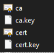
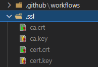
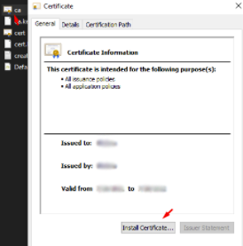
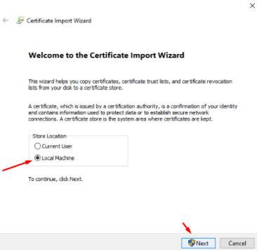
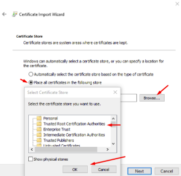
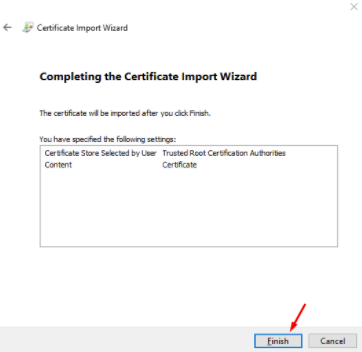
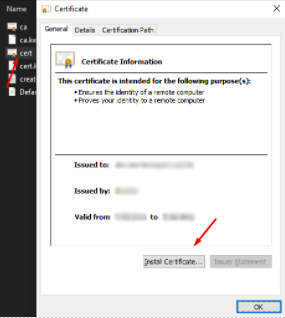
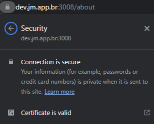

# Rule of 3

by [J.Meira](https://github.com/J-Meira)

Documentation and Standard Development Environment

## Table of Contents

- [Introduction](#introduction)
- [Requirements](#requirements)
  - [Ensure permissions for yarn](#ensure-permissions-for-yarn)
- [Installation](#installation)
  - [Install mkcert](#install-mkcert)
  - [Create certificates](#create-certificates)
  - [Clone the repository](#clone-the-repository)
  - [Copy certificates to project folder](#copy-certificates-to-project-folder)
  - [Install certificates](#install-certificates)
- [Configuration](#configuration)
  - [Create .env file](#create-env-file)
  - [Edit Windows host files](#edit-windows-host-files)
  - [Login on GitHub package repository](#login-on-github-package-repository)
- [Usage](#usage)
  - [Install dependencies](#install-dependencies)
  - [Observations](#observations)
  - [Run application](#run-application)
- [Conclusion](#conclusion)

## Introduction

Simple Rule of 3 calculator in React.Js

[Click here](https://rule-of-3.jm.app.br) to access the demo published on AWS server.

I based the application on the Material Designer system, leveraging my expertise as a senior front-end developer focusing on React with TypeScript. To streamline the development process, I utilized my own developer theme called Mui Theme, which aligns with Mui Core V5. This theme serves as a centralized resource for setting up and defining components, allowing me to efficiently manage and maintain multiple projects in a single place. If you'd like to explore the Mui Theme, you can find it at [Mui Theme](https://mui-theme.jm.app.br). This approach not only enhances consistency across projects but also simplifies maintenance, making it easier to update and customize the components as needed.

## Requirements

Before proceeding with the installation, make sure you have the following prerequisites installed:

- [Node.js](https://nodejs.org/en/download/)
- [Yarn](https://classic.yarnpkg.com/en/docs/install#windows-stable)

### Ensure permissions for yarn

Run the following command in PowerShell as an administrator:

```bash
Set-ExecutionPolicy Unrestricted
```

Note: If you don't want to run on HTTPS, you can skip steps 2, 3, 5, 6, and 8.

## Installation

### Install mkcert

To install mkcert, run the following command:

```bash
yarn global add mkcert
```

### Create certificates

Create the certificates using the following commands:

```bash
mkcert create-ca --organization "ca_name" --country-code "BR" --state "State Name" --locality "City Name"
```

```bash
mkcert create-cert --domains dev.jm.app.br
```

Result:



### Clone the repository

Clone the repository using Git:

```bash
git clone https://github.com/J-Meira/rule-of-3
```

### Copy certificates to project folder

Copy the certificates to the project folder:



### Install certificates

ATTENTION: Make sure the browser is closed before proceeding.

#### CA:

<br>
<br>
<br>


#### dev.jm.app.br:



(Same process as the previous certificate)

## Configuration

### Create .env file

Create a `.env` file in the project root directory and add the following environment variables:

```bash
REACT_APP_VERSION=v-0.0.1
REACT_APP_V_DATE=2022-02-18T20:21:52
PORT=3006
# The following should be set only if the certificates were created and installed
HOST=dev.jm.app.br
HTTPS=true
SSL_CRT_FILE=./.ssl/cert.crt
SSL_KEY_FILE=./.ssl/cert.key
```

### Edit Windows host files

Follow these steps to edit the Windows host files:

1. Open Notepad as administrator.
2. Open the host file: `C:\Windows\System32\drivers\etc\hosts`
3. Add the following line at the end of the file:

```bash
#React local servers
	127.0.0.1 	dev.jm.app.br
```

4. Restart the machine.

### Login on GitHub package repository

To login to the GitHub package repository, run the following command:

```bash
yarn login --registry=https://npm.pkg.github.com --scope=@j-meira
```

## Usage

### Install dependencies

To install the project dependencies, run the following command:

```bash
yarn
```

### Observations

If you need to access the application from another machine on the network, remove or rename the "HOST" line in the .env file. Add the IP address of the development machine to the host file on the accessing machine and install the certificates on it. Once this is done, both machines can access the application using the development domain https://dev.jm.app.br:3008.

Example host file entry:

```bash
#React local servers
	192.168.0.2 	dev.jm.app.br
```

### Run application

To run the application, use the following command:

```bash
yarn start
```

## Conclusion

Congratulations! You have successfully set up the Marvel Heroes application. After running the application, you should see the expected result in the browser:



If you have any questions or suggestions for improvement, please contact [J.Meira](https://github.com/J-Meira).
